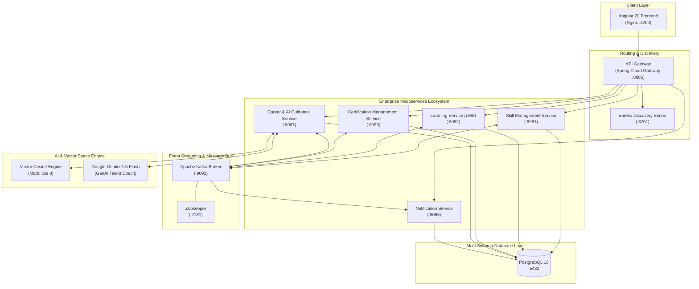

# Enterprise Learning Platform with Skill & Career Guidance System

[](https://www.oracle.com/java/)
[](https://spring.io/projects/spring-boot)
[](https://angular.dev/)
[](https://kafka.apache.org/)
[](https://www.postgresql.org/)
[](https://www.docker.com/)
[](https://ai.google.dev/)
[](LICENSE)

An enterprise-grade, cloud-native workforce intelligence ecosystem engineered to unify **employee competency benchmarking (L1–L5)**, **continuous learning journeys (LMS)**, **ISO-aligned certification compliance**, and **AI-driven career progression matching**.

---

## Architecture Overview

The system is built on an event-driven, distributed microservices architecture orchestrating inter-service communication through **Spring Cloud Gateway**, **Netflix Eureka Service Discovery**, and **Apache Kafka Event Streams**.



---

## Core Microservice Modules

### 1. Skill & Talent Management Service (`backend/skill-management-service`)
* **Port**: `8081` | **Database**: `skillsphere`
* **Features**:
  * Comprehensive Employee 360 Profile management.
  * Hierarchical Competency Framework & Skill Matrix (Proficiency levels 1 to 5).
  * Skill assessments, score recordings, and real-time gap evaluations.
  * Emits `skill-created`, `skill-assigned`, and `assessment-completed` Kafka events.

### 2. Learning Service / LMS (`backend/learning-service`)
* **Port**: `8082` | **Database**: `skillsphere_learning`
* **Features**:
  * Course catalog management with module content, video streams, and interactive resources.
  * Student enrollment tracking, progress telemetry, and scoring engine.
  * Automated certificate generation and completion badges upon passing criteria.
  * Publishes `course-completed` events consumed by Certification & Career services.

### 3. Certification Management Service (`backend/certification-management-service`)
* **Port**: `8083` | **Database**: `skillsphere_certification`
* **Features**:
  * ISO-aligned professional certification registry and lifecycle verification.
  * Expiration tracking, automated renewal notifications, and compliance reporting.
  * Synchronization with Employee Skill Matrix upon certificate verification.

### 4. Career Development & AI Guidance Service (`backend/career-service`)
* **Port**: `8087` | **Database**: `skillsphere_career`
* **Features**:
  * **Mathematical Vector Space Model**: Computes multidimensional Cosine Similarity ($\cos\theta$) between employee skill profiles and benchmark target roles.
  * **Calibrated Promotion Readiness Probability**: Weighted formula evaluating assessments ($25\%$), external certs ($15\%$), tenure ($10\%$), and vector similarity ($50\%$).
  * **Explainable AI (XAI) Gap Matrix**: Identifies exact level deficits ($L0 \rightarrow L3, +3$) and maps targeted curriculum bridges.
  * **Google Gemini 1.5 Flash GenAI**: Synthesizes executive talent coaching summaries and strategic milestone plans with zero hallucination.

### 5. Notification Hub Service (`backend/notification-service`)
* **Port**: `8086` | **Database**: `skillsphere_notification`
* **Features**:
  * Real-time reactive notification delivery.
  * Consumes Kafka topics across all microservices for enrollment, completion, and certification renewal events.

---

## Role-Based Access Control (RBAC)

The platform enforces strict enterprise security boundaries across all views, actions, and API routes:

| Feature / Workspace | Learner | Employee | HR Manager | Administrator |
| :--- | :---: | :---: | :---: | :---: |
| **Personal Learning & Enrolled Courses** | Allowed | Allowed | Allowed | Allowed |
| **Course Catalog & Interactive Learn View** | Allowed | Allowed | Allowed | Allowed |
| **Personal 360 Profile & Roadmap** | - | Allowed | Allowed | Allowed |
| **Talent & Employee Management** | - | - | Allowed | Allowed |
| **LMS Course Creation & Content Management**| - | - | Allowed | Allowed |
| **Certification Governance & Compliance** | - | - | Allowed | Allowed |
| **Assign Mentors & Toggle Promotion Criteria** | - | - | Allowed | Allowed |
| **Set & Edit Career Objective Target** | - | - | - | **Allowed (Admin Only)** |

---

## Machine Learning & AI Architecture

```
                       ┌──────────────────────────────────────────────┐
                       │           Employee Profile Data              │
                       │ (Skills L1-L5, Assessments, Certs, Tenure)   │
                       └──────────────────────┬───────────────────────┘
                                              │
                                              ▼
                       ┌──────────────────────────────────────────────┐
                       │   Multi-Dimensional Feature Vector Builder   │
                       │         u = [w₁, w₂, w₃, ..., wₙ]           │
                       └──────────────────────┬───────────────────────┘
                                              │
                    ┌─────────────────────────┴─────────────────────────┐
                    ▼                                                   ▼
┌───────────────────────────────────────┐   ┌───────────────────────────────────────┐
│ Vector Space Similarity Engine        │   │ Multi-Criteria Probabilistic Model    │
│ Cosine Similarity:                    │   │ Readiness = f(Cosine, Assessments,    │
│ cos(θ) = (u · v) / (||u|| ||v||)      │   │               Certs, Tenure, Gaps)    │
└───────────────────┬───────────────────┘   └───────────────────┬───────────────────┘
                    │                                           │
                    └─────────────────────────┬─────────────────┘
                                              │
                                              ▼
                       ┌──────────────────────────────────────────────┐
                       │ Explainable AI (XAI) & Gap Matrix Generator │
                       │    - Mathematical Gap Level: Δ = L_target - L_curr │
                       │    - Priority Ranking: HIGH / MEDIUM / LOW   │
                       │    - Actionable Course Resolution Bridge     │
                       └──────────────────────┬───────────────────────┘
                                              │
                                              ▼
                       ┌──────────────────────────────────────────────┐
                       │ Google Gemini 1.5 Flash GenAI Talent Coach   │
                       │ - Executive Talent Summary                   │
                       │ - Strategic Milestone Acceleration Steps     │
                       │ - Graceful Local Inference Fallback          │
                       └──────────────────────────────────────────────┘
```

1. **Cosine Vector Similarity Formula**:
   $$\cos(\theta) = \frac{\mathbf{u} \cdot \mathbf{v}}{\|\mathbf{u}\| \|\mathbf{v}\|} = \frac{\sum_{i=1}^{n} u_i v_i}{\sqrt{\sum_{i=1}^{n} u_i^2} \sqrt{\sum_{i=1}^{n} v_i^2}}$$

2. **Fault-Tolerant Hybrid Fallback**:
   If an external Gemini API key is not supplied or the network is offline, the system seamlessly triggers its local contextual inference engine without disrupting the client experience.

---

## Technology Stack

### Backend & Infrastructure
* **Core Language**: Java 17 (LTS)
* **Framework**: Spring Boot 3.x / 4.x, Spring Cloud Gateway, Netflix Eureka
* **Security & Auth**: Spring Security, JWT (JSON Web Tokens), BCrypt
* **Data Persistence**: Spring Data JPA, Hibernate, PostgreSQL 16
* **Message Broker**: Apache Kafka 7.4, Zookeeper
* **Containerization**: Docker, Docker Compose

### Frontend
* **Framework**: Angular 20 (Standalone Components, Signals, Reactive State)
* **Styling**: Vanilla Custom CSS, CSS Grid, Glassmorphism, Aurora Ambient Glow
* **Icons**: Handcrafted Minimalist SVG Iconography (Zero AI-generated emojis)
* **Build & Bundle**: Angular CLI, Vite/esbuild, Nginx

---

## Quick Start Guide

### Prerequisites
* [Docker Desktop](https://www.docker.com/products/docker-desktop/) (v24+) & Docker Compose
* [Java 17 JDK](https://adoptium.net/) *(Optional for local Maven builds)*
* [Node.js 20+ & npm](https://nodejs.org/) *(Optional for local frontend builds)*

---

### Running the Entire Platform with Docker Compose

1. **Clone the repository**:
   ```bash
   git clone https://github.com/Srijita2004/Enterprise-Learning-Platform-with-skill-and-career-guidance-system.git
   cd Enterprise-Learning-Platform-with-skill-and-career-guidance-system
   ```

2. **Build and launch all 11 microservices & containers**:
   ```bash
   docker compose up -d --build
   ```

3. **Verify running containers**:
   ```bash
   docker compose ps
   ```

4. **Access the application**:
   * **Web Application (Frontend)**: [http://localhost:4200](http://localhost:4200)
   * **API Gateway**: [http://localhost:8085](http://localhost:8085)
   * **Eureka Discovery Dashboard**: [http://localhost:8761](http://localhost:8761)

---

## Default Service Ports

| Service | Port | Description |
| :--- | :--- | :--- |
| **Frontend** | `4200` | Angular Web Application (via Nginx) |
| **API Gateway** | `8085` | Central Request Routing & JWT Verification |
| **Eureka Server** | `8761` | Service Registry & Health Telemetry |
| **Skill Service (M1)** | `8081` | Employee Profile & Competency Management |
| **Learning Service (M2)** | `8082` | LMS Course Engine & Assessment Scoring |
| **Certification (M3)** | `8083` | Professional Credential & Compliance Registry |
| **Career Service (M4)** | `8087` | Vector Space Engine & Gemini GenAI Advisor |
| **Notification Hub** | `8086` | Real-time Reactive Kafka Notifications |
| **PostgreSQL Database** | `5432` | Multi-Schema Relational Storage |
| **Apache Kafka Broker** | `9092` | Distributed Event Streaming Bus |

---

## Default Login Credentials

Use the demo credentials on the landing authentication screen to explore different permission levels:

| Role | Username / Email | Password | Access Level |
| :--- | :--- | :--- | :--- |
| **Administrator** | `admin` | `admin123` | Full enterprise control, edit career targets |
| **HR Manager** | `hr_manager` | `hr123` | Talent management, mentor assignments, criteria |
| **Employee** | `employee` | `emp123` | Personal profile, career roadmap, course tracks |
| **Learner** | `learner` | `learner123` | Personal course catalog, training modules, certs |

---

## Project Structure

```
Enterprise-Learning-Platform/
├── backend/
│   ├── career-service/                    # M4: Vector Cosine Math & GenAI Coach
│   ├── certification-management-service/  # M3: ISO Credential & Compliance Hub
│   ├── learning-service/                  # M2: LMS Tracks, Modules & Tests
│   ├── notification-service/              # Reactive Kafka Notification Bus
│   └── skill-management-service/          # M1: Employee 360 & Skill Matrix L1-L5
├── frontend/                              # Angular 20 Standalone Web App
│   ├── src/
│   │   ├── app/
│   │   │   ├── core/                      # Guards, Interceptors, API Services
│   │   │   ├── features/                  # Login, Auth, Dashboards
│   │   │   ├── learning/                  # Courses, Assessments, Certificates
│   │   │   └── pages/                     # Career Analytics, Talent Management
│   │   └── assets/                        # SVG Branding & Icons
├── infrastructure/
│   ├── api-gateway/                       # Spring Cloud Gateway
│   ├── eureka-server/                     # Netflix Eureka Registry
│   └── postgres-init/                     # Database schemas & seed scripts
├── docker-compose.yml                     # Multi-container orchestration
├── LICENSE                                # MIT License
└── README.md                              # Project Documentation
```

---

## License

This project is licensed under the **MIT License** - see the [LICENSE](LICENSE) file for details.

---

## Author & Acknowledgements

Developed by **[Srijita2004](https://github.com/Srijita2004)**.
* Engineered with modern Cloud-Native Microservice best practices.
* Designed for high scalability, fault tolerance, explainable AI, and strict enterprise governance.
